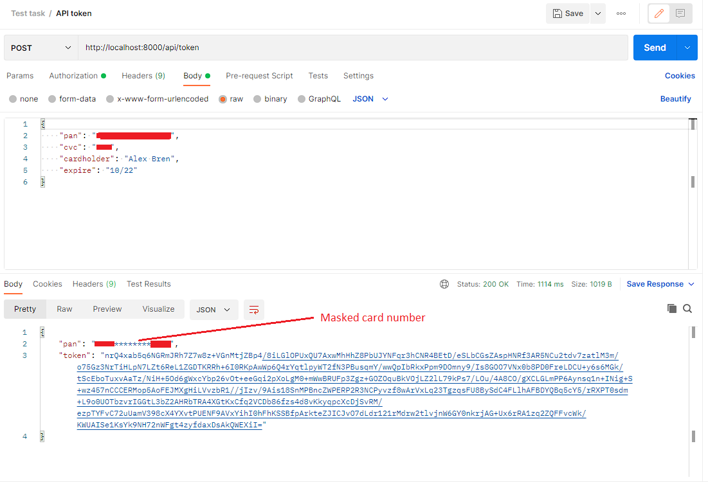

## About Project

This project was created to demonstrate json data handling using Laravel framework. The example data are debit card details. The task is to generate expiration date for token and encrypt it using RSA with base64 encoding, card number must be masked, encrypted expiration date must be logged and not saved in DB. To determine if card number is valid the Luhn algorithm was used.

## Installation

- get the latest version from git repo
- create .env file to describe connection to DB
- in project directory `php composer.phar install`
- `php artisan key:generate`
- `php artisan migrate`
- `php artisan serve`

## Demonstration

